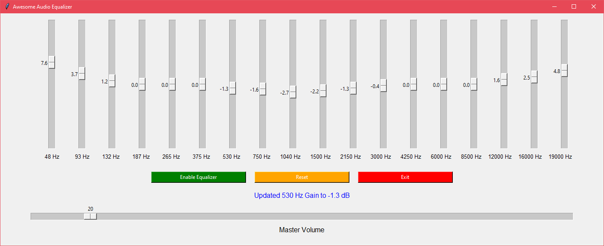
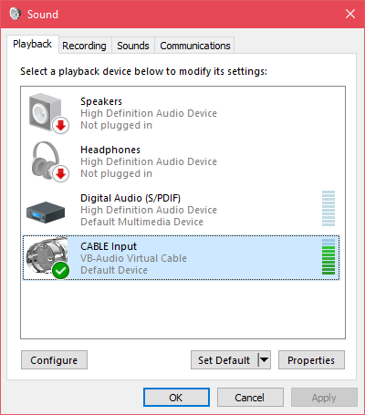

# Awesome Audio Equalizer

Applies audio equalizer and volume control to all sound directed to your default audio output device (speaker, headset etc.). In other words, this is a global, system-wide audio equalizer that manipulates all sound your computer makes!

If you've used Winamp or foobar2000, you're probably already familiar with this rather technical looking view:



Simply adjust frequency band gain sliders that you want to tune. Lower frequencies tune bass sounds and higher ones tune treble sounds. Then just click "Enable Equalizer" and enjoy your enhanced audio, no matter where it's coming from!

## Requirements

Currently only tested on Windows 10, might work with other operating systems too.

- Python 3.6 or newer
- [VB-AUDIO Virtual Audio Cable](https://vb-audio.com/Cable/index.htm) (not available on Linux)
- A speaker of some sort (to hear the sound, duh!)


## Setup

The recommended way to use this software is to first install a virtual audio cable from here: https://vb-audio.com/Cable/index.htm

After VB-Audio Virtual Cable installation, open your `Sound > Playback` settings and configure them like this:



At this point no sound should be playing at all, which is normal, as the equalizer is not running to pass the sound between virtual and real output devices.

Then install grab your favorite python interpreter and install dependencies with

```bash
pip install -r requirements.txt
```

Then you need to select your real output audio device, and write its name to `config.ini` file, e.g.,

```ini
output_device_name=Digital Audio (S/PDIF)
```
In Windows setup, the `output_device_name` parameter should match the name listed in `Sound > Playback` window.

Then just run `python aa_equalizer.py`. Enjoy!

## General Troubleshooting

### Help, my audio sounds horrible or has terrible latency!

Try playing around with the `config.ini` settings:

```ini
sample_rate=48000    # trade-off between sound quality and processing speed
block_size=8192      # this is similar, it affects latency a lot
num_dsp_processes=2  # you can ramp up this number if you have CPU cores to spare
max_queue_size=10    # This affects overall app responsiveness
```
Use reasonable numbers (i.e., positive integers) and test one parameter at a time whether it improves performance and/or sound quality. Although these are already reasonable default values so I advice not to change them too drastically. Remember, you need to restart the app for your changes to take effect!

### I don't need that virus looking console window to pop up on the background!

The console is indeed not needed for normal usage, but it sure helps with debugging technical problems. You may disable it simply by renaming the script to `aa_equalizer.pyw`.
